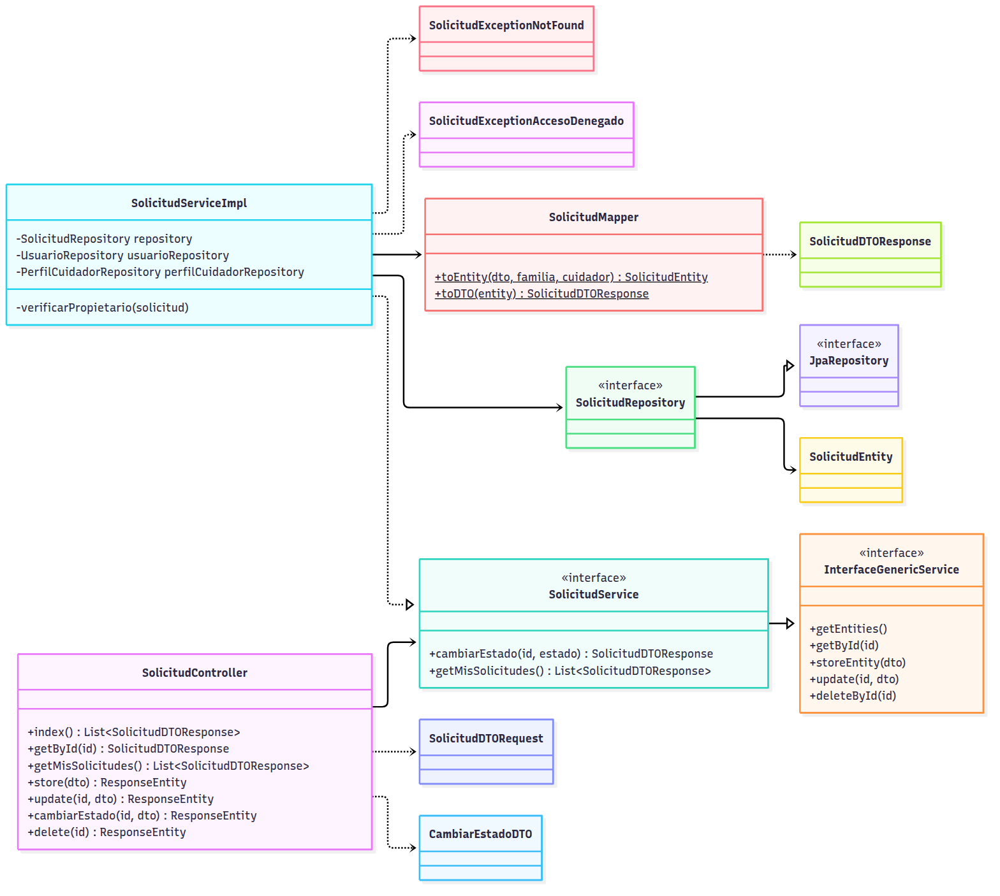
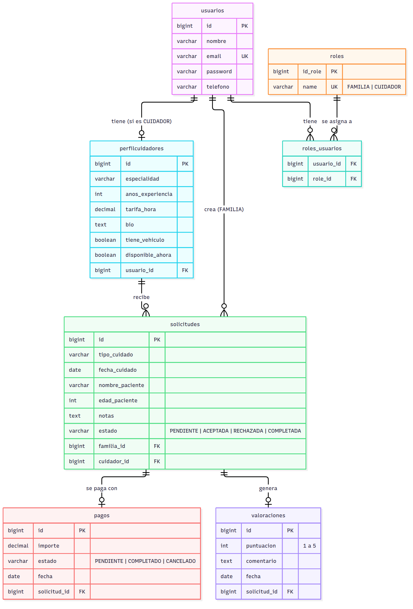
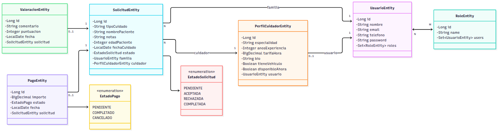
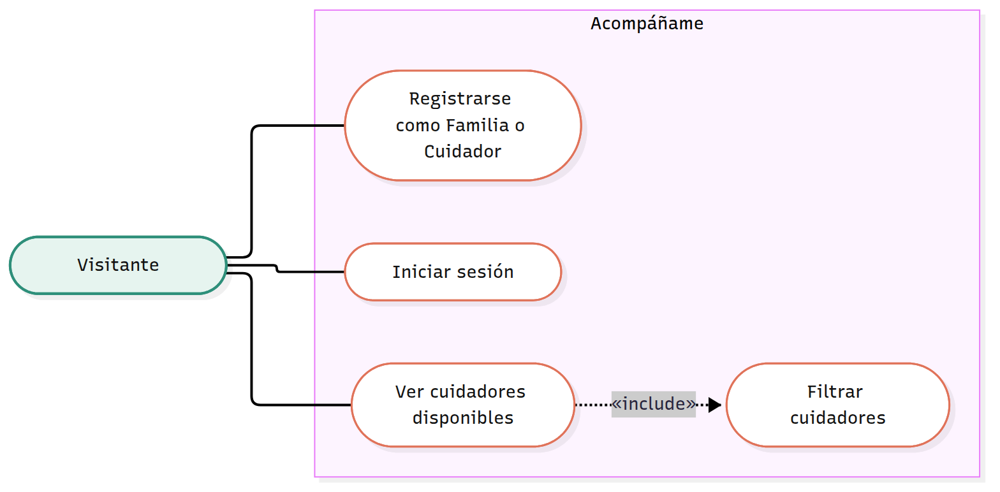
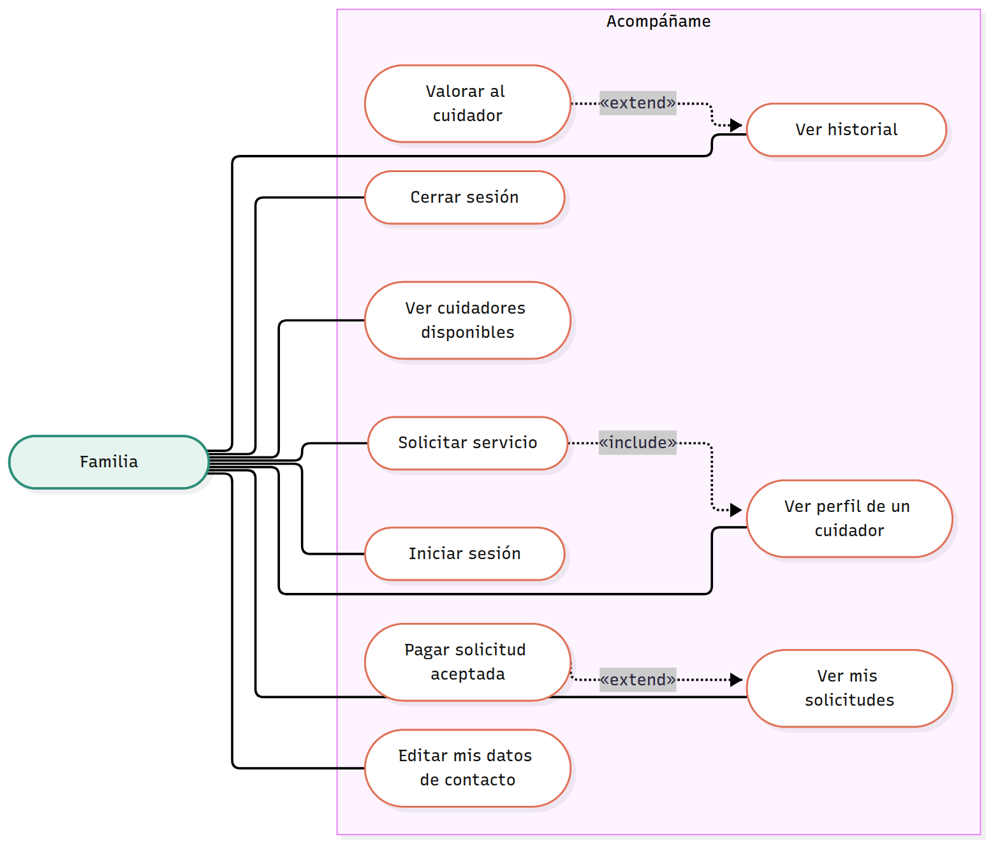
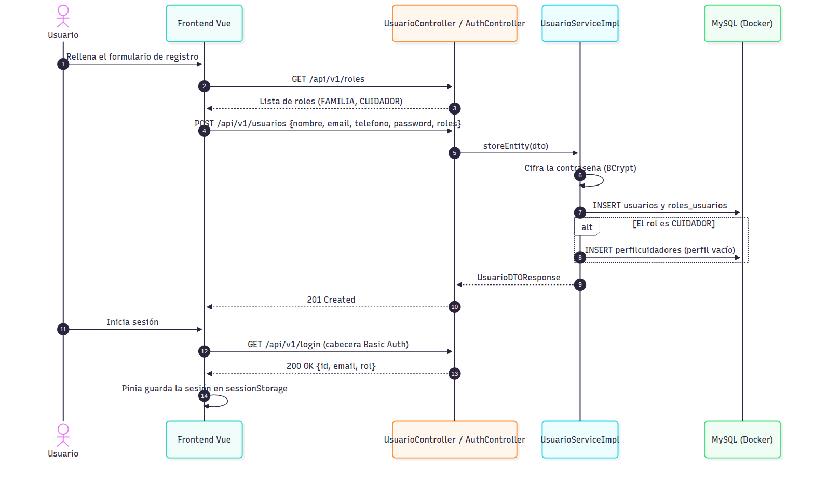
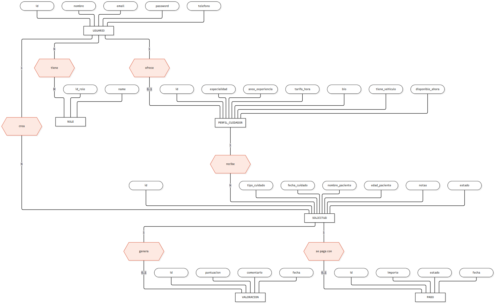
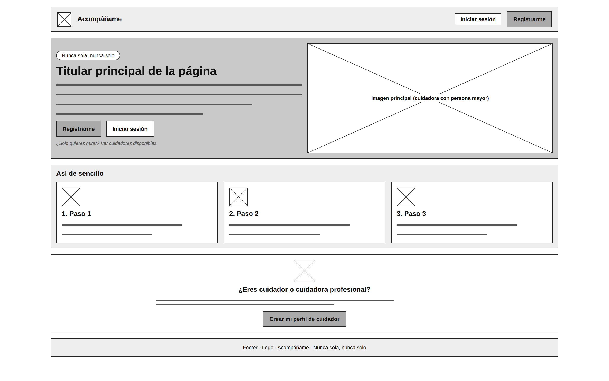
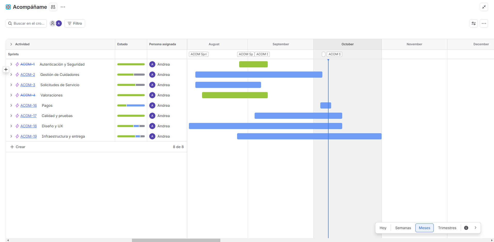

# 🤝 Acompáñame — Backend

**Acompáñame** es una plataforma de marketplace que conecta a familias que necesitan cuidados para un ser querido con cuidadores profesionales verificados. Nace para cubrir el hueco entre la atención residencial a tiempo completo y las listas de espera de la atención formal, dando una alternativa flexible tanto a personas mayores como a familias que viven lejos de sus seres queridos.

Este repositorio contiene la **API REST** del proyecto, desarrollada con **Spring Boot**. El frontend (Vue.js) vive en un repositorio independiente, enlazado más abajo.

Proyecto final del bootcamp de Desarrollo Web Full Stack (850h) en **Factoría F5 — Digital Academy**.

    

---

## 📑 Tabla de contenidos

- [Descripción del proyecto](#-descripción-del-proyecto)
- [Tecnologías utilizadas](#-tecnologías-utilizadas)
- [Arquitectura y patrones de diseño](#-arquitectura-y-patrones-de-diseño)
- [Modelo de datos](#-modelo-de-datos)
- [Instalación y puesta en marcha](#-instalación-y-puesta-en-marcha)
- [Configuración](#-configuración)
- [Endpoints de la API](#-endpoints-de-la-api)
- [Seguridad](#-seguridad)
- [Testing](#-testing)
- [Diagramas técnicos](#-diagramas-técnicos)
- [Diseño y prototipo](#-diseño-y-prototipo)
- [Gestión del proyecto](#-gestión-del-proyecto)
- [Decisiones técnicas](#-decisiones-técnicas)
- [Limitaciones conocidas](#-limitaciones-conocidas)
- [Roadmap / Mejoras futuras](#-roadmap--mejoras-futuras)
- [Enlaces del proyecto](#-enlaces-del-proyecto)
- [Autoría](#-autoría)

---

## 📖 Descripción del proyecto

**Acompáñame** resuelve un problema real: encontrar apoyo puntual y de confianza para el cuidado de personas mayores o dependientes, sin necesidad de contratar servicios residenciales completos.

La plataforma permite a las **familias**:
- Registrarse y gestionar su cuenta
- Buscar y consultar perfiles de cuidadores
- Crear solicitudes de servicio detallando el tipo de cuidado necesario
- Pagar el servicio (pago simulado)
- Valorar el servicio recibido una vez completado

Y a los **cuidadores**:
- Registrarse y crear su perfil profesional (especialidad, experiencia, tarifa, disponibilidad)
- Consultar y gestionar las solicitudes que reciben
- Aceptar, rechazar o marcar como completadas las solicitudes

---

## 🛠 Tecnologías utilizadas

| Categoría | Tecnología |
|---|---|
| Lenguaje | Java 21 |
| Framework | Spring Boot 4.1.1 |
| Seguridad | Spring Security (autenticación Basic Auth + roles) |
| Persistencia | Spring Data JPA / Hibernate |
| Base de datos | MySQL 8.0 (dockerizada) |
| Build tool | Maven |
| Reducción de boilerplate | Lombok |
| Testing | JUnit 5, Mockito, MockMvc, Testcontainers |
| Contenerización | Docker / Docker Compose |
| Control de versiones | Git / GitHub |

---

## 🏗 Arquitectura y patrones de diseño

El backend sigue una **arquitectura en capas** (MVC) clásica de Spring Boot, aplicando principios SOLID y buenas prácticas de diseño orientado a objetos:

```
Cliente (HTTP)
      │
      ▼
 Controller   ──►  recibe la petición, valida el DTO de entrada, delega en el Service
      │
      ▼
   Service    ──►  contiene la lógica de negocio; interfaz + implementación
      │
      ▼
  Repository  ──►  acceso a datos (Spring Data JPA)
      │
      ▼
   Entity     ──►  representación de las tablas en base de datos
```

Un paquete por funcionalidad:

```
dev.andrea.acompaname_backend
├── auth            Login / logout
├── generics        InterfaceGenericService (contrato CRUD común)
├── globals         GlobalExceptionHandler
├── pago            Pagos
├── perfilcuidador  Perfiles de cuidador
├── role            Roles
├── security        SecurityConfiguration, JpaUserDetailsService
├── solicitud       Solicitudes de servicio
├── usuario         Usuarios
└── valoracion      Valoraciones
```



**Patrones y principios aplicados:**

- **DTO (Data Transfer Object):** las entidades JPA nunca se exponen directamente en la API. Cada recurso tiene su `DTORequest` (datos de entrada, con validación) y `DTOResponse` (datos de salida, sin campos sensibles como la contraseña).
- **Mapper:** clases estáticas dedicadas a convertir entre `Entity` ↔ `DTO`, manteniendo el resto del código libre de esa lógica de transformación.
- **Interfaces genéricas:** `InterfaceGenericService<Entity, DTORequest, DTOResponse>` centraliza la firma de los métodos CRUD comunes a las entidades, evitando duplicación de código.
- **Inyección de dependencias por constructor:** en todos los `Service` y `Controller`, favoreciendo la inmutabilidad y la facilidad de testeo (frente a `@Autowired` en campo).
- **Excepciones personalizadas:** cada entidad cuenta con su propia jerarquía de excepciones (`XException` → `XExceptionNotFound`, `XExceptionAccesoDenegado`), capturadas de forma centralizada por un `GlobalExceptionHandler` (`@RestControllerAdvice`) que devuelve respuestas claras y con el código HTTP correcto.
- **Encapsulación:** todos los campos de las entidades son privados, con acceso exclusivo a través de getters/setters.

---

## 🗄 Modelo de datos

El sistema gira en torno a **seis entidades principales**:

| Entidad | Descripción |
|---|---|
| `UsuarioEntity` | Usuario del sistema (familia o cuidador). Relación `@ManyToMany` con `RoleEntity`. |
| `RoleEntity` | Rol del usuario (`FAMILIA` / `CUIDADOR`). |
| `PerfilCuidadorEntity` | Perfil profesional de un cuidador. Relación `@OneToOne` con `UsuarioEntity`. |
| `SolicitudEntity` | Solicitud de servicio de una familia a un cuidador. Relaciones `@ManyToOne` con `UsuarioEntity` (familia) y `PerfilCuidadorEntity` (cuidador). |
| `ValoracionEntity` | Valoración de una solicitud completada. Relación `@OneToOne` con `SolicitudEntity`. |
| `PagoEntity` | Pago de una solicitud (`PENDIENTE`, `COMPLETADO`, `CANCELADO`). Relación `@OneToOne` con `SolicitudEntity`. |

### Diagrama Entidad-Relación



### Diagrama de clases



---

## 🚀 Instalación y puesta en marcha

### Requisitos previos

- Java 21
- Maven (o usar el wrapper `./mvnw` incluido)
- Docker y Docker Compose
- Git

### Pasos

1. **Clona el repositorio**
   ```bash
   git clone https://github.com/AndreaVaGo/acompaname-backend.git
   cd acompaname-backend
   ```

2. **Levanta la base de datos con Docker Compose**
   ```bash
   docker compose up -d
   ```
   Esto crea un contenedor MySQL (`acompaname-mysql`) con la base de datos `acompaname_db`, disponible en el puerto `3306`.

3. **Arranca la aplicación**
   ```bash
   ./mvnw spring-boot:run
   ```
   La API quedará disponible en `http://localhost:8080/api/v1`

4. **Ejecuta los tests** (opcional, pero recomendado; los de integración necesitan Docker arrancado)
   ```bash
   ./mvnw test
   ```

---

## 🔐 Configuración

Los valores de desarrollo local están en `docker-compose.yml` y en `src/main/resources/application.properties`:

| Ajuste | Valor |
|---|---|
| Contenedor | `acompaname-mysql` (mysql:8.0) |
| Base de datos | `acompaname_db` |
| Usuario / contraseña | `acompaname_user` / `acompaname_pass` |
| Contraseña root | `root` |
| Puerto | `3306` |
| Volumen | `acompaname_data` |
| Prefijo de la API (`api-endpoint`) | `api/v1` |
| Origen CORS permitido | `http://localhost:5173` (frontend) |

> ⚠️ Estas credenciales son **solo para desarrollo local**. Antes de desplegar habría que sacarlas a variables de entorno.

---

## 📡 Endpoints de la API

Todos los endpoints tienen como prefijo base: `/api/v1`

### Autenticación

| Método | Ruta | Descripción | Acceso |
|---|---|---|---|
| `GET` | `/login` | Inicio de sesión (Basic Auth) | Público (requiere credenciales válidas) |
| `GET` | `/logout` | Cierre de sesión | Autenticado |

### Usuarios (`/usuarios`)

| Método | Ruta | Descripción | Acceso |
|---|---|---|---|
| `POST` | `/usuarios` | Registro de un nuevo usuario | Público |
| `GET` | `/usuarios` | Listar todos los usuarios | Autenticado |
| `GET` | `/usuarios/{id}` | Obtener un usuario por id | Autenticado (propietario) |
| `PUT` | `/usuarios/{id}` | Actualizar un usuario | Autenticado (propietario) |
| `DELETE` | `/usuarios/{id}` | Eliminar un usuario | Autenticado (propietario) |

### Roles (`/roles`)

| Método | Ruta | Descripción | Acceso |
|---|---|---|---|
| `POST` | `/roles` | Crear un rol | Público |
| `GET` | `/roles` | Listar los roles | Autenticado |

### Perfiles de cuidador (`/cuidadores`)

| Método | Ruta | Descripción | Acceso |
|---|---|---|---|
| `POST` | `/cuidadores` | Crear perfil de cuidador | Rol `CUIDADOR` |
| `GET` | `/cuidadores` | Listar todos los perfiles | Autenticado |
| `GET` | `/cuidadores/{id}` | Obtener un perfil por id | Autenticado |
| `GET` | `/cuidadores/mi-perfil` | Obtener el perfil del cuidador autenticado | Autenticado |
| `PUT` | `/cuidadores/{id}` | Actualizar un perfil | Rol `CUIDADOR` (propietario) |
| `DELETE` | `/cuidadores/{id}` | Eliminar un perfil | Rol `CUIDADOR` (propietario) |

### Solicitudes (`/solicitudes`)

| Método | Ruta | Descripción | Acceso |
|---|---|---|---|
| `POST` | `/solicitudes` | Crear una solicitud de servicio | Rol `FAMILIA` |
| `GET` | `/solicitudes` | Listar todas las solicitudes | Autenticado |
| `GET` | `/solicitudes/{id}` | Obtener una solicitud por id | Autenticado |
| `GET` | `/solicitudes/mis-solicitudes` | Solicitudes del usuario autenticado | Autenticado |
| `PUT` | `/solicitudes/{id}` | Actualizar una solicitud | Rol `FAMILIA` (propietario) |
| `DELETE` | `/solicitudes/{id}` | Eliminar una solicitud | Rol `FAMILIA` (propietario) |
| `PATCH` | `/solicitudes/{id}/estado` | Cambiar el estado (`PENDIENTE`, `ACEPTADA`, `RECHAZADA`, `COMPLETADA`) | Autenticado |

### Valoraciones (`/valoraciones`)

| Método | Ruta | Descripción | Acceso |
|---|---|---|---|
| `POST` | `/valoraciones` | Crear una valoración | Autenticado |
| `GET` | `/valoraciones` | Listar todas las valoraciones | Autenticado |
| `GET` | `/valoraciones/{id}` | Obtener una valoración por id | Autenticado |
| `PUT` | `/valoraciones/{id}` | Actualizar una valoración | Autenticado (propietario) |
| `DELETE` | `/valoraciones/{id}` | Eliminar una valoración | Autenticado (propietario) |

### Pagos (`/pagos`)

| Método | Ruta | Descripción | Acceso |
|---|---|---|---|
| `POST` | `/pagos` | Crear un pago | Autenticado |
| `GET` | `/pagos` | Listar todos los pagos | Autenticado |
| `GET` | `/pagos/{id}` | Obtener un pago por id | Autenticado |
| `PUT` | `/pagos/{id}` | Actualizar un pago | Autenticado |
| `DELETE` | `/pagos/{id}` | Eliminar un pago | Autenticado |
| `PATCH` | `/pagos/{id}/pagar` | Marcar el pago como completado (simulado) | Autenticado |

### Ejemplo de petición — Registro de usuario

```http
POST /api/v1/usuarios
Content-Type: application/json

{
  "nombre": "Ana",
  "email": "ana@ejemplo.com",
  "telefono": "600123456",
  "password": "contraseñaSegura123",
  "rolesIds": [1]
}
```

**Respuesta (`201 Created`):**
```json
{
  "id": 1,
  "nombre": "Ana",
  "email": "ana@ejemplo.com",
  "telefono": "600123456",
  "roles": ["FAMILIA"]
}
```

---

## 🔒 Seguridad

El backend implementa autenticación y autorización mediante **Spring Security**:

- **Autenticación:** HTTP Basic Auth sobre las credenciales del usuario (email + contraseña).
- **Almacenamiento de contraseñas:** cifradas con `BCryptPasswordEncoder`; nunca se guardan ni se devuelven en texto plano.
- **Gestión de usuarios:** `JpaUserDetailsService` propio, que consulta la tabla `usuarios` real (sin usuarios hardcodeados en memoria).
- **Roles:** cada usuario tiene uno o varios roles (`FAMILIA`, `CUIDADOR`) almacenados en una tabla `roles` con relación `@ManyToMany`.
- **Autorización por endpoint:** `POST`, `PUT` y `DELETE` de `/cuidadores` solo para `CUIDADOR`; `POST`, `PUT` y `DELETE` de `/solicitudes` solo para `FAMILIA`.
- **Protección frente a IDOR:** los servicios comprueban que el recurso pertenece al usuario autenticado y lanzan `XExceptionAccesoDenegado` (Usuario, PerfilCuidador, Solicitud y Valoración), por lo que no se pueden leer ni modificar datos ajenos adivinando ids.
- **CORS:** solo se permite el origen `http://localhost:5173`, con los métodos `GET`, `POST`, `PUT`, `DELETE` y `PATCH`.
- **Rutas públicas:** registro de usuario (`POST /usuarios`), creación de roles (`POST /roles`) y login (`GET /login`); el resto de rutas requieren autenticación.
- **Manejo de errores:** respuestas normalizadas y sin exposición de detalles internos (`GlobalExceptionHandler`).

> 🔜 **Próxima mejora:** migración de Basic Auth a autenticación mediante **JWT** (token de clave simétrica).

---

## 🧪 Testing

El proyecto cuenta con **43 tests** que cubren la lógica de negocio, la capa de exposición HTTP y la integración con base de datos real:

- **Tests unitarios de Service** (`Mockito`): cada `ServiceImpl` está testeado de forma aislada, mockeando sus repositorios.
- **Tests de Controller** (`MockMvc` + `@WebMvcTest`): verifican que cada endpoint responde con el código de estado y el cuerpo JSON esperados.
- **Tests de integración** (`Testcontainers`): `UsuarioRepositoryIntegrationTest` y `SecurityIntegrationTest` se ejecutan contra un MySQL real en contenedor.

```bash
./mvnw test
```

> 🔜 **Pendiente:** tests del módulo `Pago`.

---

## 📊 Diagramas técnicos

### Casos de uso

| Visitante | Familia | Cuidador |
|---|---|---|
|  |  |  |

### Secuencia: registro y login



### Secuencia: solicitar un servicio


### Modelo Chen



---

## 🎨 Diseño y prototipo

Bocetos, wireframes y mockups para móvil, tablet y escritorio. El conjunto completo está en [`docs/design`](docs/design).

| Landing | Buscar | Perfil del cuidador |
|---|---|---|
|  |  |  |

- **Figma:** <ENLACE_FIGMA>
- **Prototipo en Lovable:** https://care-connection-hub-18.lovable.app

---

## 📋 Gestión del proyecto

La planificación y el seguimiento del proyecto se han gestionado en **JIRA** (proyecto `ACOM`), organizados en:

- 8 épicas: Autenticación y Seguridad, Gestión de Cuidadores, Solicitudes de Servicio, Valoraciones, Pagos, Calidad y pruebas, Diseño y UX, Infraestructura y entrega
- 19 historias de usuario con criterios de aceptación en formato Gherkin
- 16 tareas técnicas
- 5 sprints entre agosto y octubre de 2026

🔗 Enlace al tablero de JIRA: https://saludosalamanecer-1780468848301.atlassian.net/jira/software/projects/ACOM/boards/34/timeline?rangeMode=MONTHS




---

## 🧭 Decisiones técnicas

📄 Documento completo con el proceso y los problemas encontrados: [docs/decisiones-tecnicas.pdf](docs/decisiones-tecnicas.pdf)

Documentar el porqué de las decisiones, no solo el qué, para dejar constancia del proceso de desarrollo:

| Decisión | Motivo |
|---|---|
| **Roles en tabla `roles` (`@ManyToMany`) en lugar de un enum simple** | Un enum bastaba funcionalmente (un usuario = un rol), pero modelar los roles como entidad propia sigue el patrón estándar de Spring Security, permite añadir permisos/roles nuevos sin tocar código, y es coherente con proyectos reales. |
| **Lombok** | Reduce drásticamente el código repetitivo de getters, setters y constructores en las entidades, mejorando la legibilidad sin perder funcionalidad. |
| **`UsuarioEntity` no se separa en "datos de autenticación" y "datos de perfil"** | Se valoró separar en dos tablas (una solo para login, otra para el resto de datos), pero para el alcance de este proyecto se optó por mantenerlos juntos, priorizando simplicidad sobre una normalización que no aportaba valor funcional inmediato. |
| **DTOs explícitos en cada capa de entrada/salida** | Evita exponer las entidades JPA directamente (y con ellas, campos sensibles como la contraseña), y protege frente a *mass assignment* al aceptar solo los campos declarados explícitamente. |
| **Interfaz genérica `InterfaceGenericService<Entity, DTORequest, DTOResponse>`** | Las entidades comparten las mismas operaciones CRUD; centralizar su firma en una interfaz genérica evita repetir el mismo contrato en cada módulo. |
| **Excepciones personalizadas por entidad + `GlobalExceptionHandler` centralizado** | Permite devolver códigos HTTP y mensajes claros y específicos (`403`, `404`, `409`...) en lugar de errores genéricos, mejorando la experiencia de quien consume la API. |
| **Autorización por rol en la creación, edición y borrado** | Refleja la lógica de negocio real: cada rol solo debe poder generar y gestionar el tipo de recurso que le corresponde dentro del flujo de la plataforma. |
| **Comprobación de propietario en el Service (anti-IDOR)** | Un usuario autenticado solo puede tocar sus propios datos, aunque conozca el id de otro recurso. |
| **`ddl-auto=update` en lugar de `create-drop`** | Al trabajar contra una base de datos persistente en Docker (no en memoria), se prioriza no perder datos entre reinicios de la aplicación durante el desarrollo. |
| **Testcontainers para los tests de integración** | Prueban contra un MySQL real, igual que en ejecución, en lugar de una base de datos en memoria distinta. |

---

## ⚠️ Limitaciones conocidas

De forma transparente, estas son las áreas identificadas como pendientes de mejora en la versión actual:

- **Autenticación mediante Basic Auth**, no JWT. La migración a JWT está prevista como siguiente paso.
- **Credenciales de desarrollo en el código** (`application.properties` y `docker-compose.yml`). Habría que pasarlas a variables de entorno antes de desplegar.
- **Pagos simulados:** no hay pasarela de pago real y el módulo `Pago` aún no tiene tests.
- **Sin límite de intentos de login** (protección básica frente a fuerza bruta pendiente).

---

## 🗺 Roadmap / Mejoras futuras

Funcionalidades identificadas como **Fase 2**, fuera del alcance del MVP entregado:

- Autenticación mediante JWT
- Pasarela de pago real (por ejemplo Stripe en modo test)
- Geolocalización de cuidadores en tiempo real
- Videollamadas y chat en tiempo real
- Notificaciones push
- Generación de informes en PDF
- Filtros de búsqueda avanzados (especialidad, tarifa, disponibilidad)
- Despliegue (imagen Docker y base de datos en la nube)

---

## 🔗 Enlaces del proyecto

| Recurso | Enlace |
|---|---|
| Repositorio Backend | [github.com/AndreaVaGo/acompaname-backend](https://github.com/AndreaVaGo/acompaname-backend) |
| Repositorio Frontend | [github.com/AndreaVaGo/acompaname-frontend](https://github.com/AndreaVaGo/acompaname-frontend) |
| Presentación | [docs/presentacion.pdf](docs/presentacion.pdf) |
| Tablero JIRA | https://saludosalamanecer-1780468848301.atlassian.net/jira/software/projects/ACOM/boards/34/timeline?rangeMode=MONTHS |
| Diseño en Figma | <ENLACE_FIGMA> |
| Prototipo Lovable | https://care-connection-hub-18.lovable.app |

---

## 👩‍💻 Autoría

Proyecto desarrollado por **Andrea Vallina González** como Proyecto Final del bootcamp de Desarrollo Web Full Stack en **Factoría F5 — Digital Academy**.

- GitHub: [@AndreaVaGo](https://github.com/AndreaVaGo)
- LinkedIn: [Andrea Vallina González](https://www.linkedin.com/in/andrea-vallina-gonzalez/)

---